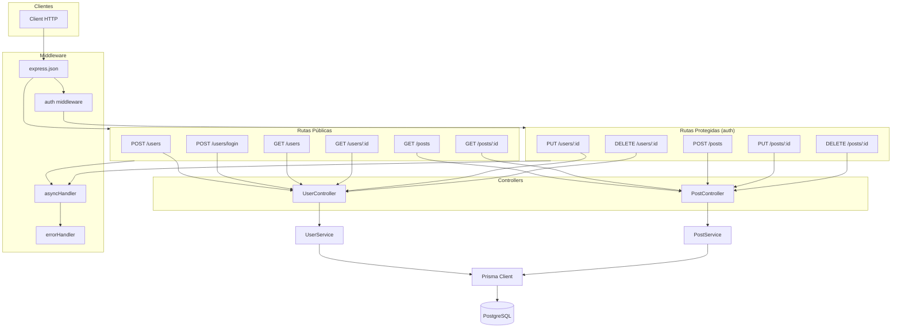
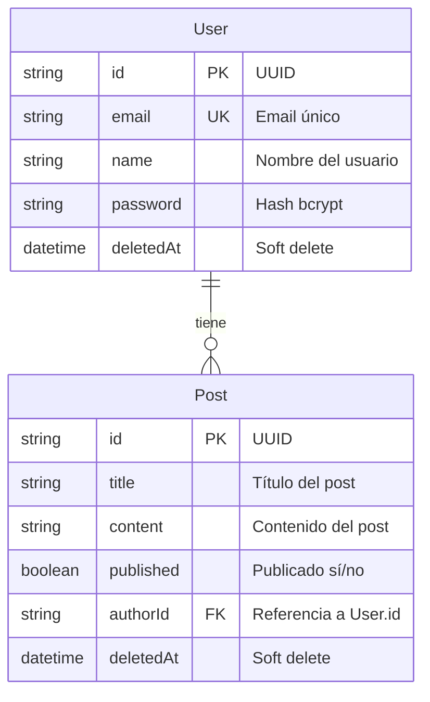
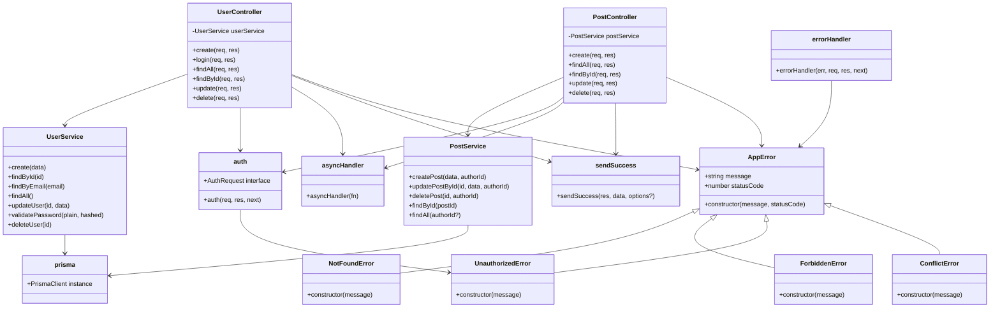

# BlogProject API

API REST para un blog con usuarios y posts. La armé con Express + TypeScript + Prisma + PostgreSQL, todo corriendo con Docker.

La idea era tener algo limpio, bien estructurado y listo para mostrar. Le metí manejo de errores centralizado, auth con JWT, validación con Zod, soft delete, y tests.

---

## Stack

| Capa | Qué usé |
|------|---------|
| Runtime | Node 24, TypeScript 5.9 |
| Framework | Express 5 |
| ORM | Prisma 7 con adapter PostgreSQL |
| DB | PostgreSQL 15 |
| Auth | JWT (jsonwebtoken + bcrypt) |
| Validación | Zod 4 |
| Tests | Jest + Supertest |
| Infra | Docker + docker-compose |

---

## Arquitectura

Viene todo explicado con diagramas en la carpeta [`Docs/`](Docs/):

- [Diagrama de la API REST](Docs/api-diagram.md) — rutas, middleware, flujo
- [Modelo de datos](Docs/data-model.md) — entidades, relaciones, campos
- [Arquitectura de clases](Docs/class-architecture.md) — controllers, services, errores

En dos palabras: **Controllers -> Services -> Prisma**. Los controllers no tienen lógica de negocio, solo orquestan. Los services hacen las validaciones y tiran `AppError` cuando algo no está bien. El `errorHandler` centralizado se encarga de responder con el formato correcto.

---

## Cómo levantar el proyecto

```bash
# Clonás el repo
git clone https://github.com/Aaron-CtrlC/BlogProject.git
cd BlogProject

# Lo levantás con Docker
docker compose up
```

La primera vez tarda porque builda la imagen (npm install, prisma generate, etc). Después arranca al toque.

Apenas está listo, la API responde en `http://localhost:3000`.

### Variables de entorno

Están configuradas en `docker-compose.yml`. Las que necesitás:

| Variable | Descripción |
|----------|-------------|
| `DATABASE_URL` | Connection string a PostgreSQL |
| `JWT_SECRET` | Secreto para firmar tokens (cambialo antes de usar en producción) |
| `PORT` | Puerto donde escucha el server (default: 3000) |

Si falta alguna al arrancar, la app no se levanta — `src/config/env.ts` se encarga de validarlas.

---

## Endpoints

| Método | Ruta | Auth | Descripción |
|--------|------|------|-------------|
| POST | /users | ❌ | Crear usuario |
| POST | /users/login | ❌ | Iniciar sesión → devuelve JWT |
| GET | /users | ❌ | Listar usuarios |
| GET | /users/:id | ❌ | Buscar usuario por ID |
| PUT | /users/:id | ✅ | Actualizar perfil |
| DELETE | /users/:id | ✅ | Eliminar cuenta |
| POST | /posts | ✅ | Crear post |
| GET | /posts | ❌ | Listar posts |
| GET | /posts/:id | ❌ | Ver post |
| PUT | /posts/:id | ✅ | Editar post (solo dueño) |
| DELETE | /posts/:id | ✅ | Eliminar post (solo dueño) |

### Formato de respuestas

Todas las respuestas siguen el mismo formato:

```json
// Éxito
{ "success": true, "data": { ... } }

// Éxito con mensaje
{ "success": true, "data": { ... }, "message": "..." }

// Error
{ "success": false, "error": "...", "statusCode": 400 }

// Error de validación
{ "success": false, "error": "Error de validación", "details": [...], "statusCode": 400 }
```

---

## Tests

```bash
docker compose run --rm app npm test
```

Corre los tests con Jest + Supertest. Los tests pegan contra la API de verdad (conectada a PostgreSQL), así que necesitás tener los servicios de Docker levantados.

Los tests cubren:
- Validación de schemas (campos faltantes, datos inválidos)
- Creación de usuarios y posts
- Login y generación de tokens
- Auth middleware (token faltante, malformado, inválido)
- CRUD completo de users y posts
- Autorización (no podés modificar/eliminar recursos de otro)

---

## Diagramas

> También están en [`Docs/`](Docs/) como archivos separados si querés verlos en detalle.

### Arquitectura de la API



### Modelo de datos (ERD)



### Diagrama de clases



---

## Ideas para seguir

Si alguna vez le meto más tiempo, esto es lo que tengo en mente:

| Feature | Para qué |
|---------|----------|
| **Roles** (admin, user) | Usuarios con permisos especiales |
| **Categorías / Tags** | Clasificar posts por tema |
| **Comentarios** | Comentarios anidados en posts, con su propio CRUD |
| **Paginación** | `GET /posts?page=1&limit=10` para cuando haya muchos posts |
| **Rate limiting** | Evitar que alguien spamee `/users/login` |
| **Refresh tokens** | No tener que loguearse cada 7 días |
| **Subir imágenes** | Multer + S3 o similar para imágenes en posts |
| **Swagger / OpenAPI** | Documentación interactiva de la API |
| **CI/CD** | GitHub Actions que corra tests automáticamente |
| **Búsqueda** | Buscar posts por título o contenido con FTS de PostgreSQL |

