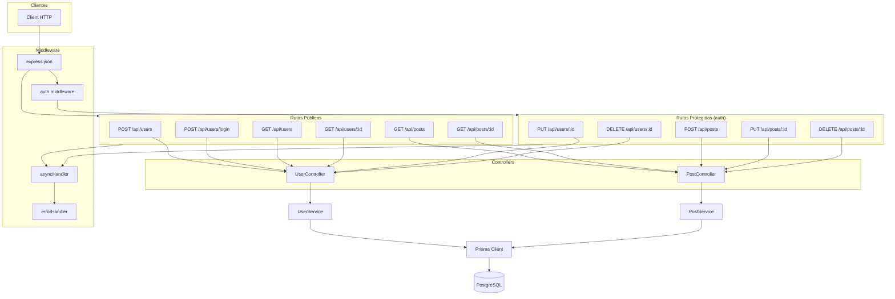

# API REST — BlogProject

### Endpoints

| Método | Ruta | Auth | Descripción |
|--------|------|------|-------------|
| POST | /users | ❌ | Crear usuario |
| POST | /users/login | ❌ | Iniciar sesión |
| GET | /users | ❌ | Listar usuarios |
| GET | /users/:id | ❌ | Obtener usuario por ID |
| PUT | /users/:id | ✅ | Actualizar propio usuario |
| DELETE | /users/:id | ✅ | Eliminar propio usuario |
| POST | /posts | ✅ | Crear post |
| GET | /posts | ❌ | Listar posts |
| GET | /posts/:id | ❌ | Obtener post por ID |
| PUT | /posts/:id | ✅ | Actualizar post propio |
| DELETE | /posts/:id | ✅ | Eliminar post propio |
