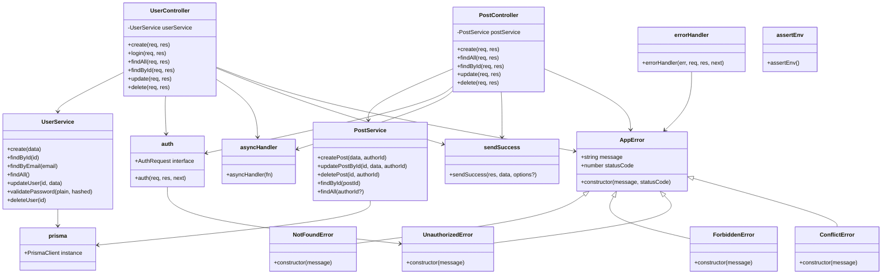

# Arquitectura de Clases — BlogProject

```mermaid
classDiagram
    class AppError {
        +string message
        +number statusCode
        +constructor(message, statusCode)
    }

    class NotFoundError {
        +constructor(message)
    }

    class ForbiddenError {
        +constructor(message)
    }

    class UnauthorizedError {
        +constructor(message)
    }

    class ConflictError {
        +constructor(message)
    }

    AppError <|-- NotFoundError
    AppError <|-- ForbiddenError
    AppError <|-- UnauthorizedError
    AppError <|-- ConflictError

    class UserController {
        -UserService userService
        +create(req, res)
        +login(req, res)
        +findAll(req, res)
        +findById(req, res)
        +update(req, res)
        +delete(req, res)
    }

    class PostController {
        -PostService postService
        +create(req, res)
        +findAll(req, res)
        +findById(req, res)
        +update(req, res)
        +delete(req, res)
    }

    class UserService {
        +create(data)
        +findById(id)
        +findByEmail(email)
        +findAll()
        +updateUser(id, data)
        +validatePassword(plain, hashed)
        +deleteUser(id)
    }

    class PostService {
        +createPost(data, authorId)
        +updatePostById(id, data, authorId)
        +deletePost(id, authorId)
        +findById(postId)
        +findAll(authorId?)
    }

    class auth {
        +AuthRequest interface
        +auth(req, res, next)
    }

    class errorHandler {
        +errorHandler(err, req, res, next)
    }

    class asyncHandler {
        +asyncHandler(fn)
    }

    class assertEnv {
        +assertEnv()
    }

    class sendSuccess {
        +sendSuccess(res, data, options?)
    }

    class prisma {
        +PrismaClient instance
    }

    UserController --> UserService
    PostController --> PostService
    UserService --> prisma
    PostService --> prisma
    UserController --> auth
    PostController --> auth
    UserController --> asyncHandler
    PostController --> asyncHandler
    UserController --> sendSuccess
    PostController --> sendSuccess
    UserController --> AppError
    PostController --> AppError
    auth --> UnauthorizedError
    errorHandler --> AppError
```
