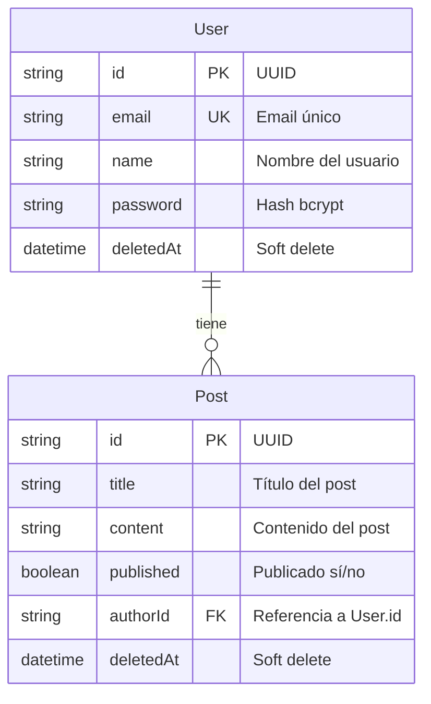

# Modelo de Datos — BlogProject

### Detalle de campos

**User**
| Campo | Tipo | Restricciones |
|-------|------|---------------|
| id | UUID | `@id @default(uuid())` |
| email | String | `@unique`, validado con Zod email |
| name | String | `min(2)` |
| password | String | `min(8).max(50)`, se almacena hasheado con bcrypt |
| deletedAt | DateTime? | Nullable, soft delete |

**Post**
| Campo | Tipo | Restricciones |
|-------|------|---------------|
| id | UUID | `@id @default(uuid())` |
| title | String | `min(10).max(200)` |
| content | String | `min(20)` |
| published | Boolean | `@default(false)` |
| authorId | String | FK → User.id |
| deletedAt | DateTime? | Nullable, soft delete |
